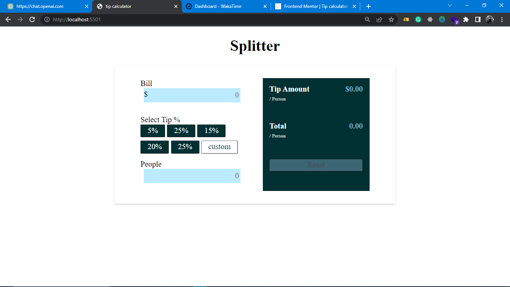

# Frontend Mentor - Manage landing page solution

This is a solution to the [Tip calculator challenge on Frontend Mentor](https://www.frontendmentor.io/challenges/tip-calculator-app-ugJNGbJUX/hub). Frontend Mentor challenges help you improve your coding skills by building realistic projects.

## Table of contents

- [Overview](#overview)
  - [The challenge](#the-challenge)
  - [Screenshot](#screenshot)
  - [Links](#links)
- [My process](#my-process)
  - [Built with](#built-with)
  - [challenges-encountered](#continued-development)

## Overview

### The challenge

users should be able to:

View the optimal layout for the app depending on their device's screen size
See hover states for all interactive elements on the page
Calculate the correct tip and total cost of the bill per person

### Screenshot

## My process

### Built with

- HTML
- CSS
- JAVASCRIPT

## challenges-encountered

only implemented the functionality to calculate the tip for one person, as for the responsiveness ugh, its more of 4/10.

- Website - [stephen](https://github.com/Oghenekparobo)
- Frontend Mentor - [Oghenekparobo](https://www.frontendmentor.io/profile/Oghenekparobo)
- Twitter - [stephenjyd](https://twitter.com/stephenjyd)
